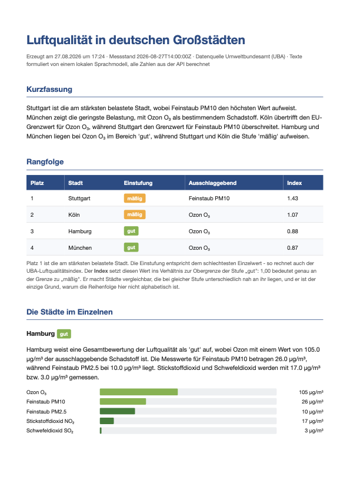
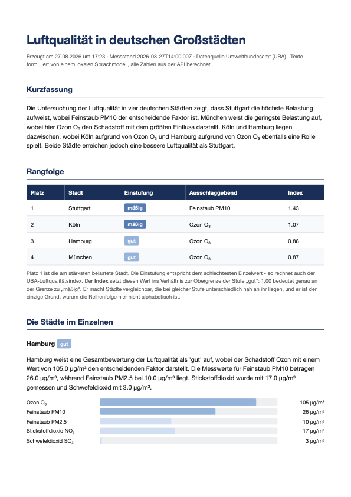

# Das Harness anpassen

`HARNESS.md` ist keine Dokumentation neben dem Code, sondern **Konfiguration**.
Version-2 und Version-3 haben je eine, und beide lesen sie beim Start ein. Wer
sie ändert, ändert das Verhalten — ohne eine Zeile Python.

| Abschnitt | Wirkt auf | Wird gelesen von |
|---|---|---|
| `## Systemprompt` | Ton und Inhalt der erzeugten Texte | `harness.py` / `planner.py` |
| `## Grenzen` | Versuche, Temperatur, Token, Höchstzahlen | `harness.py` / `planner.py` |
| `## Aufbereitung` | Farbskala, Akzentfarbe, Bezug der Balken | `report.py` / `datatools.py` |

---

## Den Ton ändern

In `Version-2/HARNESS.md`:

````markdown
## Systemprompt

```text
Du schreibst kurze, sachliche Abschnitte für einen Umweltbericht auf Deutsch.
Strikte Regeln: Verwende ausschließlich die Zahlen, die dir im Auftrag genannt werden.
…
```
````

Ersetze den Block, etwa durch „Schreibe betont knapp, höchstens ein Satz je
Abschnitt." — und starte `run.py` neu. Der Bericht liest sich anders.

!!! danger "Zwei Sätze nicht anfassen"
    Die Regeln „Verwende ausschließlich die genannten Zahlen" und „Rechne nichts
    aus" tragen die ganze Konstruktion. Ohne sie fängt das Modell an zu rechnen,
    und die Zahlenprüfung schlägt bei jedem zweiten Abschnitt an.

---

## Grenzen verschieben

```markdown
- `max_versuche: 3`
- `temperature: 0.3`
- `max_tokens_kurzfassung: 320`
- `max_tokens_stadt: 220`
```

- **`max_versuche` hoch** heißt: mehr Nachbesserungen, seltener Notfalltexte,
  längere Laufzeit.
- **`temperature` hoch** heißt: abwechslungsreichere Sprache und mehr
  beanstandete Zahlen. Über 0.7 wird es unruhig.
- **`max_tokens` niedrig** schneidet Sätze mitten ab. Der Bericht bleibt gültig,
  liest sich aber abgehackt.

In Version-3 kommen `max_staedte` und `max_titel` dazu.

---

## Farben und Aufbereitung ändern

```markdown
| Stufe | Farbe |
|---|---|
| sehr gut | `#2e7d32` |
| gut | `#7cb342` |
…
- `akzent: #204c86`
- `balken_bezug: index`
```

Version-2 liest das beim Start von `run.py`, Version-3 bei **jedem** Aufruf —
dort genügt ein Neuladen der Seite.

### Die Wirkung im PDF

=== "Standard: Ampel, Bezug `index`"

    

=== "Blau einfarbig, Bezug `grenzwert`"

    

Zwei Dinge sind anders, und beide kamen aus derselben Datei:

1. **Die Farbskala.** Statt Grün-Gelb-Rot eine einfarbige blaue Reihe. Sachlicher,
   aber die Einstufung ist nicht mehr auf einen Blick zu lesen — und die helle
   Marke auf weißem Grund ist zu kontrastarm. Eine Skala ist eine
   Gestaltungsentscheidung mit Folgen, keine Geschmacksfrage.
2. **Der Bezug der Balken.** `index` misst den Abstand zum Extremfall (Obergrenze
   „sehr schlecht"), `grenzwert` den Abstand zur rechtlichen Grenze. Bei
   identischen Messwerten schlagen die Balken bei `grenzwert` weit weiter aus.

!!! warning "Dieselben Zahlen, ein anderer Eindruck"
    Zwischen beiden Berichten hat sich kein einziger Messwert geändert. Wer die
    Aufbereitung festlegt, legt fest, was ein Leser sieht — und deshalb gehört
    diese Entscheidung sichtbar in eine Datei und nicht versteckt in ein
    Stylesheet.

### Dieselbe Änderung in der Oberfläche

=== "Standard"

    

=== "Nach Änderung in HARNESS.md"

    

---

## Was sich so nicht ändern lässt

Die **erlaubten Werte** des Plans in Version-3 — Feldnamen, Darstellungsarten,
Sortierungen — stehen zwar in `HARNESS.md` beschrieben, werden aber in
`planner.py` geprüft. Eine neue Darstellung braucht drei Dinge: einen Eintrag in
`DARSTELLUNGEN`, eine Render-Funktion in `static/app.js` und eine Zeile in
`HARNESS.md`. Das ist Absicht: Was das Modell auslösen darf, soll nicht durch
eine Textdatei erweiterbar sein.
