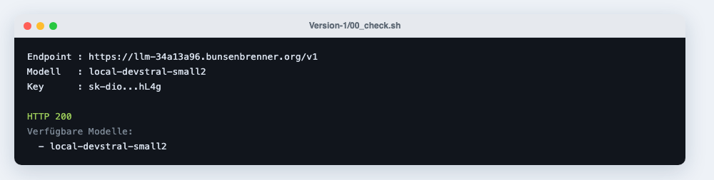
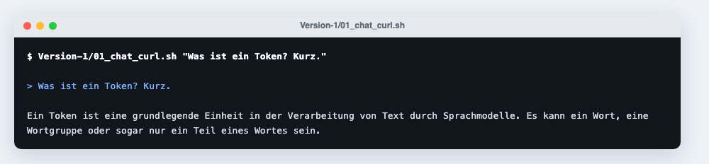
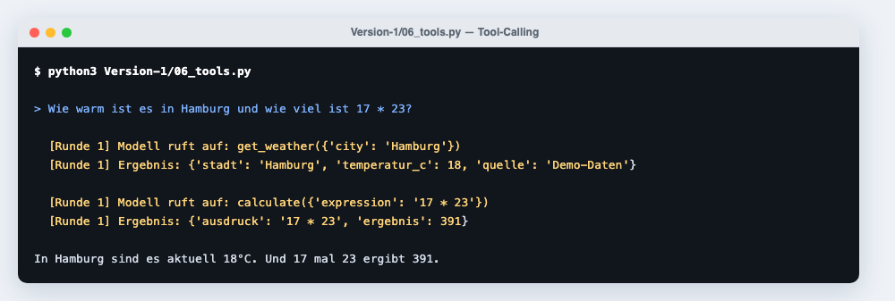

# Version-1 — Skripte

Ordner `First-API/Version-1/`.

## Dateien

| Datei | Aufruf | Zweck |
|---|---|---|
| `_common.sh` | — | Lädt `.env`, prüft die Variablen. Wird von den Shell-Skripten eingebunden |
| `00_check.sh` | `./00_check.sh` | Erreichbarkeit, Schlüssel, Modellliste |
| `01_chat_curl.sh` | `./01_chat_curl.sh "Frage"` | Eine Anfrage, eine Antwort |
| `02_stream_curl.sh` | `./02_stream_curl.sh "Frage"` | Dasselbe mit `stream: true` |
| `03_chat.py` | `python3 03_chat.py "Frage"` | Einzelne Anfrage aus Python |
| `04_stream.py` | `python3 04_stream.py "Frage"` | Streaming aus Python |
| `05_dialog.py` | `python3 05_dialog.py` | Mehrere Runden, Verlauf wird mitgeschickt |
| `06_tools.py` | `python3 06_tools.py "Frage"` | Tool-Calling mit zwei Beispielfunktionen |
| `07_openai_sdk.py` | `python3 07_openai_sdk.py "Frage"` | Derselbe Endpunkt mit `openai` |
| `llm.py` | — | Mini-Client, nur Standardbibliothek |

## `llm.py`

```python
llm.BASE_URL   # aus .env
llm.API_KEY
llm.MODEL

llm.ask(prompt, system=None, **kw) -> str
llm.chat(messages, tools=None, temperature=0.7, max_tokens=800, **kw) -> dict
llm.stream(messages, **kw) -> Generator[str]
```

`chat()` gibt die `message` des Modells zurück — also entweder mit `content`
oder mit `tool_calls`. `ask()` ist die bequeme Kurzform für einen einzelnen
Textaufruf. `stream()` liefert die Textstücke nacheinander.

`.env` wird neben der Datei und in allen Elternordnern gesucht; bestehende
Umgebungsvariablen gewinnen.

## Beispielausgaben

=== "00_check.sh"

    

=== "01_chat_curl.sh"

    

=== "06_tools.py"

    

## Tool-Calling: der Ablauf

1. Funktionen als JSON-Schema mitschicken (`tools=[…]`)
2. Antwort enthält `tool_calls` statt `content`
3. Das eigene Programm führt die Funktion aus
4. Ergebnis als `{"role": "tool", "tool_call_id": …, "content": …}` anhängen
5. Erneut fragen, bis eine Antwort ohne `tool_calls` kommt

`06_tools.py` bricht nach fünf Runden ab, damit die Schleife nie endlos läuft.
