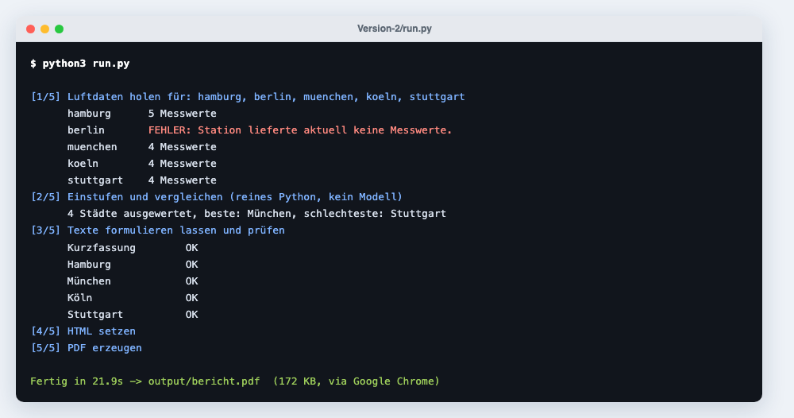
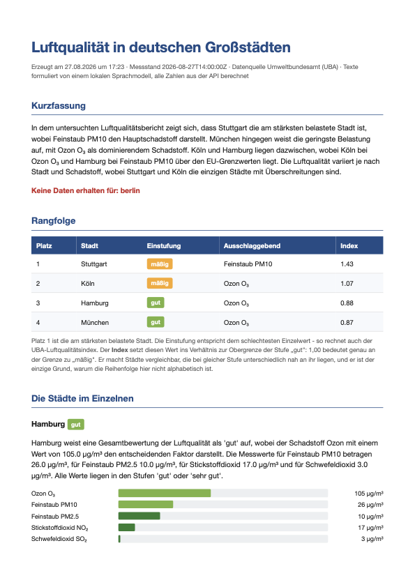
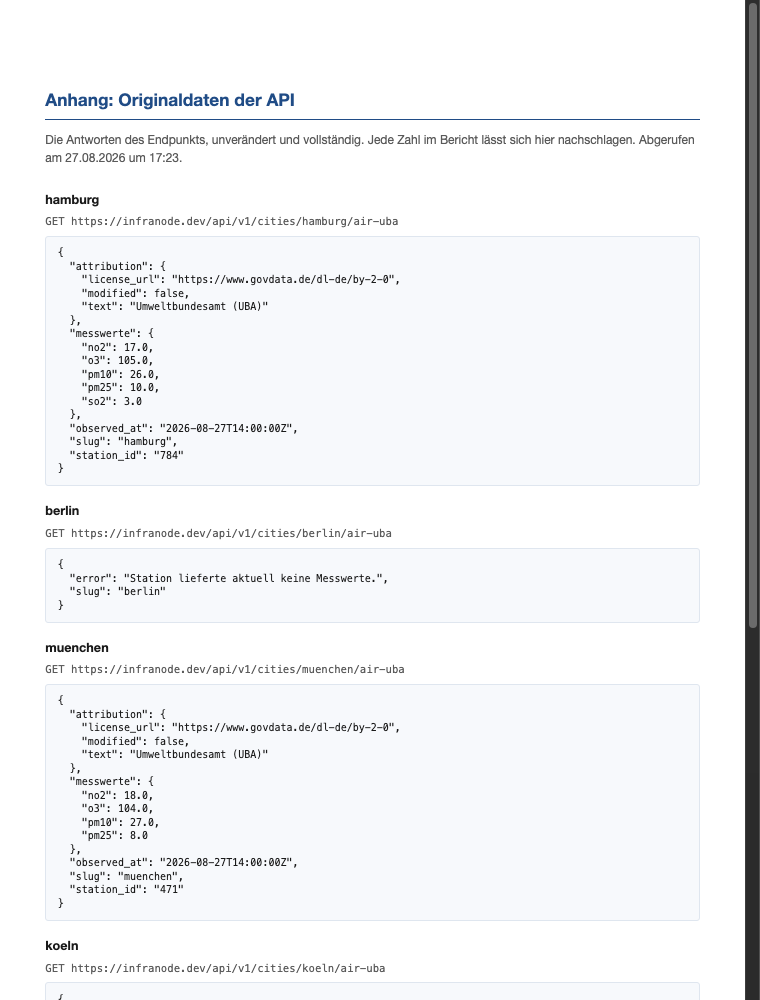

# Version-2 — Bericht

Ordner `First-API/Version-2/`. Aufruf:

```bash
python3 run.py [stadt …]
```

Ergebnis: `output/bericht.pdf` und `output/bericht.html`.



## Dateien

| Datei | Aufgabe | Modell beteiligt? |
|---|---|---|
| `run.py` | Ablaufsteuerung, Ausgabe | nein |
| `air_api.py` | Abruf der Messwerte | nein |
| `tools.py` | Einstufen, sortieren, Kennzahlen | nein |
| `harness.py` | Aufträge, Prüfung, Nachfassen, Notfalltexte | **ja** |
| `report.py` | HTML-Layout | nein |
| `pdf.py` | HTML → PDF | nein |
| `HARNESS.md` | Regeln, wird eingelesen | — |
| `llm.py` | Mini-Client | — |

## `HARNESS.md`

Wird von `harness.py` beim Start gelesen.

| Abschnitt | Ausgewertet als |
|---|---|
| `## Systemprompt` | Erster ```` ```text ````-Block → `SYSTEM` |
| `## Grenzen` | Zeilen `` `name: wert` `` → `GRENZEN` |
| `## Aufbereitung` | Farbtabelle → `FARBEN`, `` `akzent:` `` → `AKZENT`, `` `balken_bezug:` `` → `BALKEN_BEZUG` |

```python
harness.SYSTEM              # str
harness.MAX_VERSUCHE        # int, Standard 3
harness.TEMPERATUR          # float, Standard 0.3
harness.TOKENS_KURZFASSUNG  # int, Standard 320
harness.TOKENS_STADT        # int, Standard 220
harness.FARBEN              # dict[str, str]
harness.AKZENT              # str
harness.BALKEN_BEZUG        # "index" | "grenzwert"
```

## `air_api.py`

```python
fetch_city(slug, timeout=20) -> dict
fetch_cities(slugs) -> list[dict]
```

Erfolgsfall:

```python
{"slug": "hamburg", "station_id": "784",
 "observed_at": "2026-08-27T10:00:00Z",
 "messwerte": {"pm10": 23.0, "pm25": 9.0, "no2": 16.0, "o3": 79.0, "so2": 3.0},
 "attribution": {"text": "Umweltbundesamt (UBA)", "license_url": "…"}}
```

Fehlerfall: `{"slug": …, "error": "…"}`. Auch eine Station, die sich meldet, aber
keinen einzigen Wert liefert, ist ein Fehlerfall.

## `tools.py`

```python
einstufen(schadstoff, wert) -> str          # eine der fünf UBA-Stufen
stadtname(slug) -> str                      # "muenchen" -> "München"
stadt_auswerten(rohdaten) -> dict
vergleich(städte) -> dict
```

`stadt_auswerten()` liefert je Messwert:

| Feld | Bedeutung |
|---|---|
| `wert`, `einheit` | wie geliefert |
| `stufe`, `stufe_index` | UBA-Einstufung, 0 = sehr gut … 4 = sehr schlecht |
| `belastung` | Wert ÷ Obergrenze der Stufe „gut" |
| `balken_index` | Wert ÷ Obergrenze „sehr schlecht", in Prozent |
| `balken_grenzwert` | Wert ÷ EU-Grenzwert, in Prozent |
| `eu_grenzwert`, `ueber_grenzwert` | Einordnung |

Auf Stadtebene kommen `gesamtstufe`, `belastungsindex`, `treiber` und
`fehlende_schadstoffe` dazu. Die Gesamtstufe ist der **schlechteste** Einzelwert,
nicht der Mittelwert.

## `harness.py`

```python
erlaubte_zahlen(*werte, mit_messwerten=True) -> set[str]
pruefe_text(text, erlaubt) -> list[str]
schreibe_abschnitt(auftrag, daten, notfalltext, *,
                   max_tokens=None, mit_messwerten=True) -> tuple[str, dict]
```

Das Protokoll aus `schreibe_abschnitt()`:

```python
{"versuche": 2, "beanstandet": [["18.2"]], "quelle": "modell"}
```

`quelle` ist `"modell"` oder `"notfall"`. Es landet unverändert in der Tabelle
„Wie dieser Bericht entstanden ist".

`mit_messwerten=False` erlaubt **keine** Messzahlen im Text — so wird die
Kurzfassung erzeugt. Begründung:
[Was Prüfen nicht kann](../explanation/grenzen-der-pruefung.md).

## Aufbau des Berichts

| Abschnitt | Inhalt |
|---|---|
| Kurzfassung | Modelltext, ohne Zahlen |
| Rangfolge | Tabelle mit Stufe, Treiber und Belastungsindex |
| Die Städte im Einzelnen | Je Stadt ein Modelltext plus Balken |
| Wie dieser Bericht entstanden ist | Protokoll je Abschnitt |
| Anhang | Unveränderte API-Antworten samt Abruf-URL |

=== "Erste Seite"

    

=== "Anhang mit Rohdaten"

    

## `pdf.py`

```python
html_zu_pdf(html_datei, pdf_datei) -> tuple[bool, str]
```

Probiert Chrome/Chromium/Edge, dann `weasyprint`, `wkhtmltopdf`, `cupsfilter`.
Siehe [PDF-Erzeugung umstellen](../how-to/pdf-werkzeug.md).
