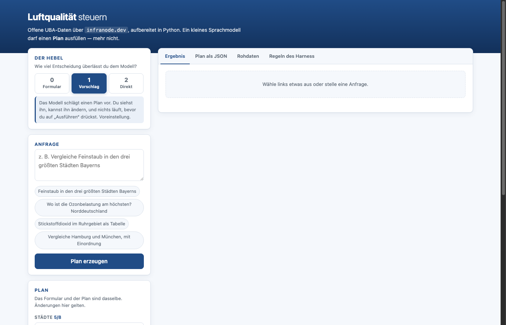
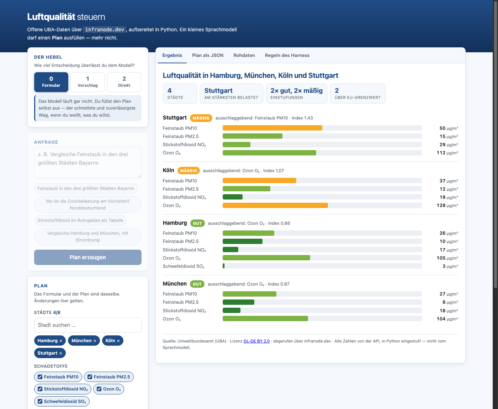
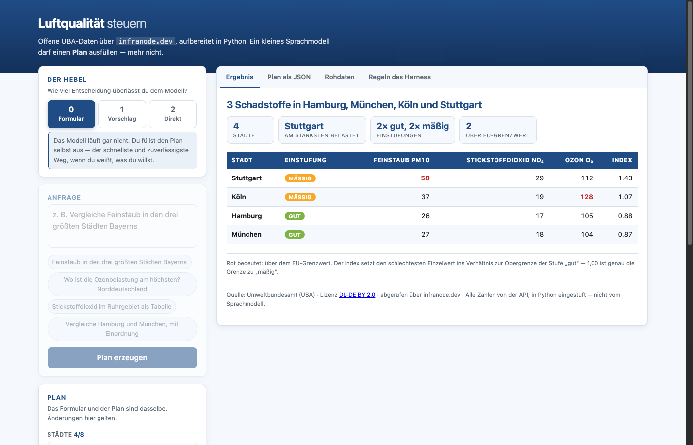
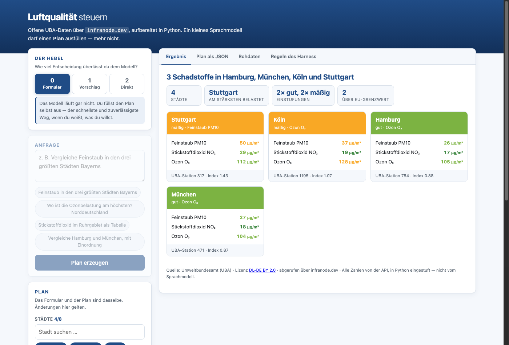

# Version-3 — Oberfläche

Ordner `First-API/Version-3/`. Aufruf:

```bash
python3 server.py [port]     # Standard 8000
```



## Dateien

| Datei | Aufgabe | Modell beteiligt? |
|---|---|---|
| `server.py` | HTTP-Server, Routen | nein |
| `air_api.py` | Städteliste und Messwerte, mit Zwischenspeicher | nein |
| `datatools.py` | Einstufen, sortieren, Kennzahlen, Farben | nein |
| `planner.py` | Prompt → Plan, Prüfung, Reparatur, Kommentar | **ja** |
| `HARNESS.md` | Regeln, wird eingelesen | — |
| `static/index.html` `style.css` `app.js` | Oberfläche | nein |

## Routen

| Pfad | Methode | Ein | Aus |
|---|---|---|---|
| `/` | GET | — | `static/index.html` |
| `/static/<datei>` | GET | — | Datei aus `static/` |
| `/api/staedte` | GET | — | `{"staedte": [{slug, name, land, einwohner}]}` |
| `/api/harness` | GET | — | `{"text": "…"}` — `HARNESS.md` im Wortlaut |
| `/api/plan` | POST | `{"prompt": "…"}` | Plan, Protokoll, Versuche, Quelle |
| `/api/run` | POST | `{"plan": {…}}` | Zeilen, Kennzahlen, Rohdaten, Kommentar |

`/api/plan` und `/api/run` sind getrennt: Planen und Ausführen sind zwei
Schritte. **Auch ein Plan aus der Oberfläche wird bei `/api/run` erneut geprüft**
— nicht nur einer vom Modell.

## Der Plan

```json
{
  "staedte":     ["hamburg", "muenchen"],
  "schadstoffe": ["pm10", "no2", "o3"],
  "sortierung":  "belastung_absteigend",
  "darstellung": "balken",
  "titel":       "Feinstaub und Stickoxide im Süden",
  "kommentar":   true
}
```

| Feld | Erlaubt | Bei Verstoß |
|---|---|---|
| `staedte` | 1–8 Slugs aus der API-Städteliste | Auflösung über Name und Slug, sonst verwerfen |
| `schadstoffe` | Teilmenge von `pm10 pm25 no2 o3 so2` | Unbekannte verwerfen |
| `sortierung` | `belastung_absteigend` `belastung_aufsteigend` `name` | Standardwert |
| `darstellung` | `tabelle` `balken` `karten` | Standardwert |
| `titel` | ≤ 80 Zeichen | Kürzen; leer → aus der Auswahl gebildet |
| `kommentar` | `true` / `false` | `false` |

## `planner.py`

```python
aufloesen(eingabe, städte) -> str | None        # "München" -> "muenchen"
pruefe_plan(plan, städte) -> tuple[dict, list[str]]
werkzeug(städte) -> list[dict]                  # Tool-Definition
plane(prompt, städte) -> dict                   # Prompt -> geprüfter Plan
kommentieren(zeilen, kennzahlen) -> dict        # zahlenfreie Einordnung
```

`plane()` wirft nie. Im Zweifel kommt der Standardplan mit einem Eintrag im
Protokoll.

`aufloesen()` normalisiert beide Seiten — kleinschreiben, Umlaute auflösen,
Sonderzeichen entfernen — und versucht danach einen eindeutigen Präfix.
`frankfurt` findet so `frankfurt-am-main`; `Munich` findet nichts, weil die API
nur deutsche Namen kennt.

## Der Hebel

| Stufe | Verhalten |
|---|---|
| 0 Formular | Kein Modellaufruf. `/api/run` direkt |
| 1 Vorschlag | `/api/plan`, Ergebnis ins Formular, dann Halt |
| 2 Direkt | `/api/plan`, danach sofort `/api/run` |

Der Hebel ändert nichts an den erlaubten Werten — nur daran, wer den Plan füllt
und ob ein Mensch dazwischen schaut.

## Darstellungen

=== "balken"

    

=== "tabelle"

    

=== "karten"

    

## Links auf einen Zustand

| Parameter | Beispiel |
|---|---|
| `stufe` | `?stufe=0` |
| `staedte` | `?staedte=hamburg,koeln` |
| `schadstoffe` | `?schadstoffe=pm10,no2` |
| `darstellung` | `?darstellung=karten` |
| `sortierung` | `?sortierung=name` |
| `kommentar` | `?kommentar=1` |
| `prompt` | `?prompt=Ozon%20im%20Ruhrgebiet` |

Mit `prompt` läuft der Modellweg, ohne der Formularweg. Beide führen sofort aus.

## Zwischenspeicher

`air_api.py` hält Antworten 300 Sekunden. Die Messwerte ändern sich stündlich —
längeres Vorhalten wäre falsch, kürzeres verschwendet Anfragen. Das Rate-Limit
der API liegt bei 300 Anfragen pro Minute und IP.
