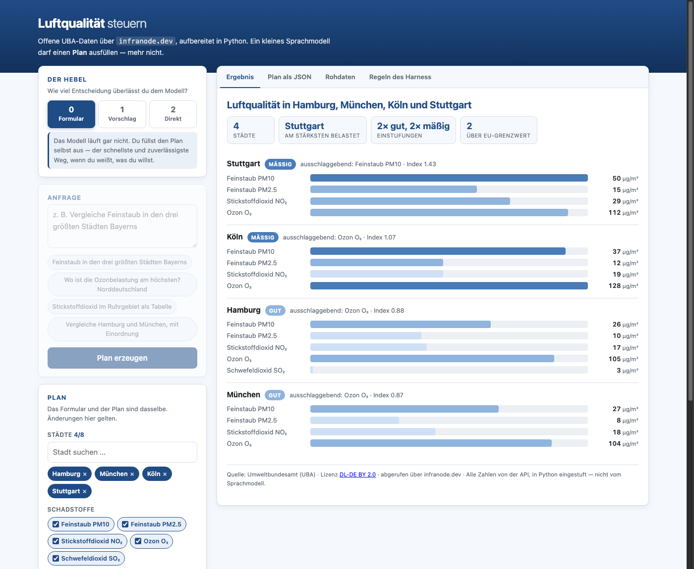

# 3 — Die erste Oberfläche

**Ziel:** Ein Satz freier Text steuert eine echte API — und du kannst zeigen,
warum dabei nichts Unvorhergesehenes passieren kann.

**Vorher:** [Der erste Bericht](erster-bericht.md).

---

## Starten

```bash
cd First-API/Version-3
python3 server.py
```

`http://localhost:8000` öffnen.


Kein `npm install`, kein Build-Schritt: `http.server` aus der Standardbibliothek
im Rücken, Vanilla-JavaScript vorne.

---

## Erst ohne Modell

Stelle den Hebel links auf **0 — Formular**. Das Modell läuft jetzt gar nicht.

Wähle ein paar Städte, hake Schadstoffe an, drücke **Ausführen**.


Das ist die Grundlinie. Alles, was du gleich per Prompt erreichst, geht auch
hier — nur langsamer zu tippen. Merk dir das: **Der Prompt ist eine Abkürzung
durch dieses Formular, kein zusätzliches Können.**

Probiere die anderen beiden Darstellungen:

=== "Tabelle"

    

=== "Karten"

    

---

## Jetzt mit Modell

Hebel auf **1 — Vorschlag** (die Voreinstellung). Tippe:

```
Vergleiche die Ozonbelastung im Ruhrgebiet, als Tabelle
```

**Plan erzeugen** drücken. Und dann: nichts läuft.

Stattdessen füllt sich das Formular links. Öffne rechts den Reiter
**Plan als JSON**:

```json
{
  "staedte": ["essen", "dortmund", "duisburg", "bochum", "wuppertal"],
  "schadstoffe": ["o3"],
  "sortierung": "belastung_absteigend",
  "darstellung": "tabelle",
  "titel": "Ozon im Ruhrgebiet",
  "kommentar": false
}
```

Das ist alles, was das Modell produziert hat. Kein HTML, kein Code, keine URL —
ein ausgefülltes Formular. Korrigiere, was dir nicht passt, und drücke
**Ausführen**.

!!! tip "Der eigentliche Hebel"
    Der sichtbare, änderbare Plan macht aus einem undurchsichtigen „die KI hat
    irgendwas gemacht" ein nachvollziehbares „das hat sie verstanden, hier
    korrigiere ich es".

---

## Das Modell danebenlegen lassen

```
Zeig mir Feinstaub in München, Gotham City und Munich
```

Nach **Plan erzeugen** erscheint links der Kasten **„Was das Harness korrigiert
hat"**:

```
· Stadt „Gotham City" kennt die API nicht — entfernt.
· Stadt „Munich" kennt die API nicht — entfernt.
```

München bleibt. Der Rest fliegt raus. Der Plan läuft trotzdem.

Das ist der Kern von `pruefe_plan()`: Es wird **repariert, nicht abgelehnt**.
Ein Plan mit einer erfundenen Stadt ist zu 80 % brauchbar — den Rest wegzuwerfen
wäre unfreundlich. Und jede Korrektur ist sichtbar, nicht stillschweigend.

Probier auch `"München"` mit Umlaut: Das wird kommentarlos zu `muenchen`
aufgelöst, denn hier gibt es nichts zu melden.

---

## Stufe 2 ausprobieren

Hebel auf **2 — Direkt**. Dieselbe Anfrage läuft jetzt sofort durch. Schneller,
aber du siehst das Ergebnis, bevor du den Plan gelesen hast. Für schnelles
Ausprobieren gut, für alles andere ist Stufe 1 die bessere Voreinstellung.

---

## Die Einordnung schreiben lassen

Setze den Haken bei **„Einordnung vom Modell schreiben lassen"** und führe aus.
Über dem Ergebnis erscheint ein kurzer Text — und darunter in klein, woher er
kommt:

> Formuliert vom Sprachmodell, geprüft vom Harness: keine Zahlen erlaubt.

Der Kommentar darf **keine einzige Messzahl** enthalten. Grund: Ein Mittelwert
und ein Stadtwert sehen für das Modell gleich aus, und es ordnet gern den einen
der falschen Stadt zu. Was nie genannt wird, kann nicht falsch zugeordnet werden.
Ausführlich: [Was Prüfen nicht kann](../explanation/grenzen-der-pruefung.md).

---

## Die Regeln lesen — in der Oberfläche

Reiter **Regeln des Harness**. Dort steht `HARNESS.md`, und zwar die Datei, die
`planner.py` tatsächlich eingelesen hat. Systemprompt, erlaubte Werte, Grenzen,
Farbskala.

Ändere in der Datei unter `## Aufbereitung` eine Farbe und lade die Seite neu:

=== "Standard"

    

=== "Nach Änderung in HARNESS.md"

    

Kein Neustart, kein Python. Mehr dazu:
[Das Harness anpassen](../how-to/harness-anpassen.md).

---

## Nachprüfen

Reiter **Rohdaten**: die unveränderten API-Antworten zu genau diesem Ergebnis.
Jede Zahl in der Ansicht ist dort nachzuschlagen.

---

## Was du jetzt kannst

- Freien Text auf eine API abbilden, ohne dem Modell die API zu geben
- Ein Modell so einsetzen, dass sein Ausfall nichts kaputt macht
- Erklären, warum ein kleines Modell hier ausreicht:
  [Der Hebel](../explanation/der-hebel.md)

Weiter mit den [How-to-Anleitungen](../how-to/index.md) — insbesondere
[Auf eigene Daten übertragen](../how-to/eigene-api.md).
